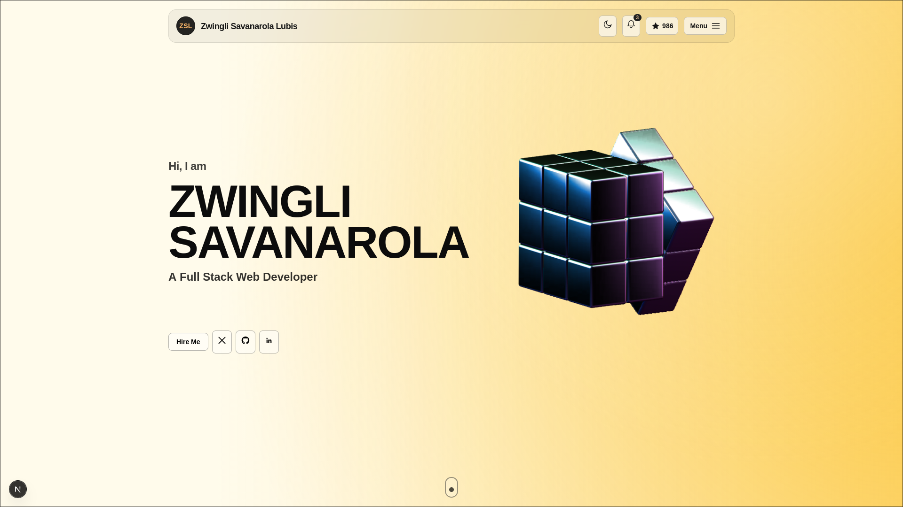

# Rubix Cube 3D Portfolio

A premium single-page hero portfolio built with Next.js, Tailwind CSS, GSAP, and Spline. still (at 5% completion)

## Demo



## Tech Stack

- Next.js 16 (App Router)
- React 19
- Tailwind CSS 4
- GSAP (entrance + ambient animations)
- Spline (interactive 3D model embed)

## Run Locally

```bash
npm install
npm run dev
```

Then open [http://localhost:3000](http://localhost:3000).

## Project Structure

- `src/app/page.tsx` — Hero section layout, UI, GSAP animation, and Spline container
- `src/app/layout.tsx` — App shell and metadata
- `src/app/globals.css` — Global styles and Tailwind setup
- `public/demo-hero.svg` — Demo preview image for this README

## Notes

- This repository currently focuses on the first (hero) section.
- Background and motion are optimized for a premium energetic visual style with strong text readability.
- This repository is not permitted to be used for commercial nor personal distribution use (except for ideas, layout, and inspiration)
